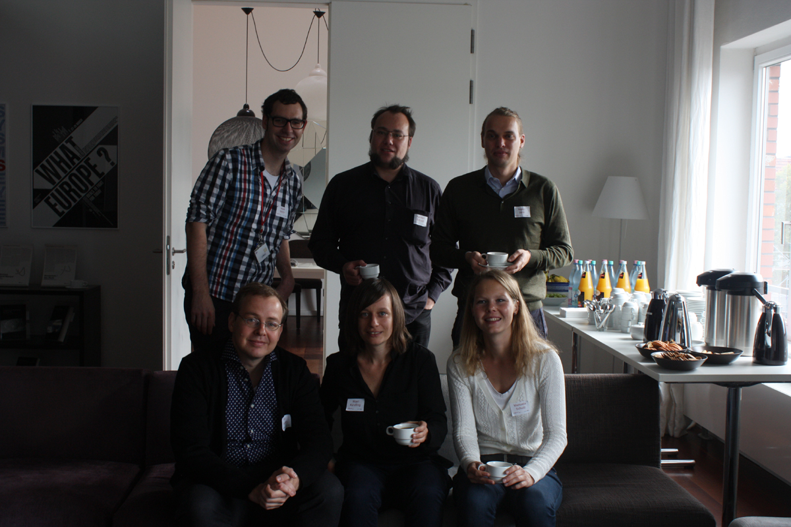

> "Okay. Fetzt." (Maxi)

Eine Idee, welche in den letzten Monaten immer wieder einmal in
bibliothekarischen Zusammenhängen auftaucht, ist das Storytelling. Man
weiss nie wirklich, was man davon halten soll: Ist das ein schlechter
Marketing-Witz, ein Versuch unkreativer Menschen sich den Nimbus der
Schriftstellerin zu borgen oder eine ernstzunehmende Methode? So oder
so: Offenbar lässt sich vieles in zusammenhängenden Stories erzählen,
mit klarem Anfang, Ablauf, Höhepunkten und Ende. Auch die letzten zehn
Jahre der LIBREAS. Library Ideas liessen sich so fassen. Eine Gruppe
Studierender mit einer Idee, die sie durchziehen auf dem Weg durch ihr
Leben (ihre Ausbildung, ihr inhaltliches, persönliches, professionelles
Wandern durch Karrieren, Lebensentscheidungen und Ortswechsel), ausbauen und dann zu einer Veranstaltung hin führen, die
wieder an den Anfang anschliesst. Aber (und hier kommen sehr schnell
wieder Zweifel an der Ernsthaftigkeit des Konzeptes Storytelling auf):
So eine klare Geschichte findet sich in schlechten Romanen und Filmen.
Gute Geschichten, gute Bücher und Filme, zeichnen sich dadurch aus,
solchen einfachen Templates nicht zu folgen. Dies gilt gerade in den
postmodernen Zeiten, in denen wir heute leben. In ihnen werden
Entscheidungen nicht getroffen, um eine Geschichte weiterzutreiben,
sondern weil sie getroffen werden müssen; in ihnen werden Inhalte
aufgegriffen, weil es gerade ein Interesse daran gibt, nicht weil sie
sich zu einer allumfassenden Schlussmoral aufbauen. Und schöne Bilder
sind schön, weil sie sich ergeben, nicht weil sie als überwältigende
Bilder geplant sind. Gute Geschichten sind so komplex wie die Welt. Und
sie kommen genau wie diese zwanglos und bestenfalls in ihrer Rahmung
geplant.

Wie gesagt: Die ersten zehn Jahre der LIBREAS. Library Ideas liessen
sich bestimmt, wenn man viel weglässt und geradebiegt, als
zusammenhängende Erzählung fassen: Hervorgegangen aus den leicht
verbrauchten, wilhelminischen Hallen des Berliner Instituts für
Bibliothekswissenschaft mit der Idee, zu fragen, was eigentlich die Idee
der Bibliothek ist; über viele, viele Texte, Ausgaben, inhaltliche
Entscheidungen, dem Auftauchen von neuen Personen oder teilweise auch
wieder dem "Verschwinden" von Einzelnen aus der Geschichte, den
persönlichen Entwicklungen (wir sind heute nicht nur fertig ausgebildet,
sondern teilweise erstaunlich "erwachsen" geworden, zum Teil), dann nach
zehn Jahren ankommend in modernen, hellen, aufgeräumten Räumen des
Berlin Institute for Cultural Inquiry, um in einer Veranstaltung die
gleiche Frage wie am Anfang zu stellen: Was ist eigentlich die Idee der
Bibliothek?

Ist das überzeugend? Wofür? Was wäre die Moral der Geschichte? Und wo
sind dann all die fehlgeplanten Ausgaben, die Artikel, die angedacht,
aber nie geschrieben wurden, die "unerwachsenen Seiten" der Zeitschrift
(und der Redaktion) hin?

Eher ist es so: Die Frage war im Namen der Zeitschrift angelegt, aber
auch nach zehn Jahren noch immer nicht beantwortet, deshalb schien es
inhaltlich sinnvoll, auf sie zurückzukommen. Die genannte Veranstaltung
fand im September 2015 tatsächlich statt, mit Vorträgen, die von der
Redaktion so ausgewählt wurden, wie auch seit zehn Jahren mehr oder
minder die Zeitschrift entsteht: Nach dem subjektiven Interesse der
Redaktion; so, wie wir sie gerne hören oder lesen würden – nicht
unbedingt, weil sich damit ein Kreis zum Jahr 2005 schliessen würde. Den
Schwerpunkt dieser Ausgabe bilden die Vorträge der Veranstaltung. Sie
werden ergänzt durch Artikel, die ähnliches vermitteln, wie die
Vorträge, nämlich das Wissen, dass die Frage, was die Idee der
Bibliothek ist, immer auch etwas anderes heisst, wenn sie von
unterschiedlichen disziplinären Positionen aus gestellt wird. Die
LIBREAS. Library Ideas verstand sich immer als eine Publikation, die den
Blick aus anderen Disziplinen auf die Bibliothek ermöglicht – die
Beiträge dieser Ausgabe zeigen unter anderem, wie differenziert "die
Bibliothek" von dieser Warte, besser: diesen Warten aussieht.

Oder anders gesagt: Die Frage ist immer noch nicht beantwortet, der
Nexus der Bibliothek nicht benannt; aber die Antworten kreisen sehr
komplex, anregend und in unterschiedlichen Zeitebenen. In einer
"überzeugenden Geschichte" wäre das wohl nicht so, aber es gibt kein
abschließendes Happy End, nur ein Happy Stage, als Zwischenstufe und in
diesem Fall tatsächlich auch als Bühne. Und es gibt einfach weiter ein
Interesse daran, eine Zeitschrift zu machen, mit der die Redaktion
selber zufrieden wäre. Wir sind sehr zufrieden, gerade mit der Vielfalt
der Perspektiven. Wir hoffen, Sie/ihr auch.

Und schließlich spricht noch etwas dagegen, diese zehn Jahre in eine
Story zu packen: Geschichten laufen immer auf ein klares Ende zu, bei
dem die Personen der Story sich entwickelt haben werden und die
Konflikte gelöst sind. Aber das ist nicht, was mit einer Zeitschrift
passiert. Die Regel lautet immer: nächste Ausgabe=nächste Ausgabe. Die
aktuelle ist eine zu einem Jubiläum. Aber kein Ende. Wir machen weiter
und wir hoffen, dass wir das mit Ihnen/euch gemeinsam tun.

Ihre/eure Redaktion LIBREAS. Library Ideas

(Berlin, Bielefeld, Chur, München)
