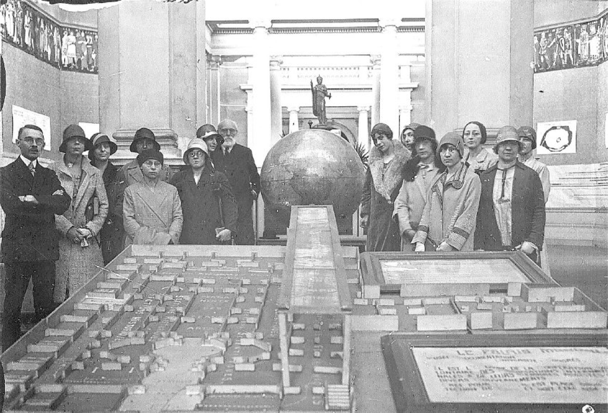
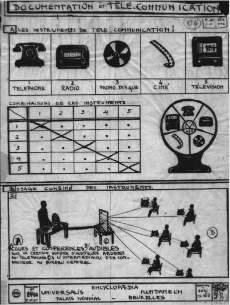

Meine Beschäftigung mit Paul Otlet (1868-1944), dem großen belgischen
Privatgelehrten der *Belle Époque*, ist jetzt genau zehn Jahre alt und
sie hat meine persönliche Auffassung von den Ursprüngen der
Informationsgesellschaft nachhaltig verändert. 2005 war ich von Boyd W.
Rayward, seinem Biographen, zu einem Symposium an die *University of
Illinois at Urbana-Champaign* eingeladen worden, um über die
Zusammenarbeit von Otlet mit Otto Neurath aus Wien zu diskutieren,
dessen Projekt einer Wissensvisualisierung wiederum eines meiner
medienhistorischen Forschungsthemen ist.[^1]

Es gab damals keine einzige deutschsprachige Publikation zu Paul Otlet,
und von seinem *Traité de Documentation*[^2] existierten kaum Exemplare
an deutschen Bibliotheken. Wo immer Bibliotheken, Archive, Zettelkästen
diskutiert worden sind, von renommierten Autoren wie Umberto Eco,
Dietrich Kerlen, Uwe Jochum bis hin zu Markus Krajewksi — überall blieb
Paul Otlet eine Leerstelle in den Darstellungen und Forschungsansätzen.
Wir haben es mit einem Bruch zu tun, der wie so vieles in der jüngeren
europäischen Geistesgeschichte auf die intellektuellen
Verdrängungsereignisse des 2. Weltkrieges zurückzuführen ist, aber auch
auf die spätere Ignoranz gegenüber den europäischen Beiträgen und
Quellen zu den neuen Informationstechnologien. Zwar erfolgte 1989 ein
Nachdruck von Otlets Hauptwerk, aber sein Projekt einer umfassenden
Dokumentation in der Universellen Bibliothek – dem *Mundaneum* – blieb
weitgehend unbekannt.

Diese Leerstelle existierte nicht nur bei schlecht informierten
Medienwissenschaftlern, wo gern historisch uniformiert über Dinge
schwadroniert wird, die man lediglich aus anderen Publikationen kennt
und nicht aus der Archivforschung. Deutlich ist auch die Mythenbildung
der technischen Erfindungen, die alles in genuin amerikanische
Erfolgsgeschichten verlagert, was an Errungenschaften zu verzeichnen
wäre, vor allem im Hinblick auf das Internet und seine Anwendungen, auf
Dokumentverknüpfung und Metadaten. Die spannende Verbindung zu den
europäischen Ingenieuren[^3] und Intellektuellen, die dazu mehr als bloß
Grundlagen erarbeiteten, blieb einfach unbeachtet.

Was so verwunderlich nun auch wieder nicht ist: Nach der Publikation
seines Hauptwerkes im Jahr 1934 blieb das *Mundaneum* in Brüssel eine
verschüttete Ruine und Paul Otlet eine weitgehend vergessene Figur, bis
1968 der australische Wissenschaftler W. Boyd Rayward die verlassenen
Archivbestände zu erforschen begann, eine intellektuelle Biographie Paul
Otlets publizierte und später auch die englische Übersetzung einer
Auswahl seiner Essays besorgte.[^4] Aber erst das Zeitalter des World
Wide Web regte die Auseinandersetzung mit diesem
Ausnahme-Intellektuellen wieder neu an, namentlich war es der
amerikanische Journalist Alex Wright, der in der New York Times von
einem ‚Ahnvater des Internet‘ zu berichten wusste, ein Artikel, der mehr
als einmal vom "Spiegel" mit ziemlich irreführenden Titeln – nun ja:
übernommen wurde.[^5] Auf Otlet zurückgreifen muss jedenfalls, wer diese
Lücke im Verständnis der Informationstechnologien schließen möchte.[^6]

Irreführend sagte ich deshalb, weil Otlet mangels Digitaltechnologie
weder ein World Wide Web der Dokumentenverknüpfung visioniert, noch eine
Suchmaschine im Stil von Google gebaut hat; er blieb an den Datenträger
Papier gebunden, wie heute die traurigen Relikte seiner Einrichtung
zeigen, die sich im belgischen Mons befinden.[^7] Seine Leistung
hingegen war, wie schon bei Rayward nachzulesen steht, die Organisation
von Wissen durch dessen Klassifikation, teils im Gegensatz, und teils in
Überbietung des bibliothekarischen Prinzips durch konsequente
Weiterentwicklung von Metadaten. Ein bloßer Visionär war er schon
deshalb nicht, weil er eine abfrageorientierte Wissensdatenbank
tatsächlich eingerichtet und kostenpflichtig betrieben hat; ab 1910 im
Brüsseler *Palais du Cinquantenaire*. Otlet hat seine Ideen also
durchaus realisiert und nicht nur visioniert. Dennoch bereitete die
damalige Technologie – etwa von ihm entworfene mechanische *Meubles
classeurs* – große Schwierigkeiten hinsichtlich der Funktionalität.
Otlet stand mit all seinen Schwierigkeiten eher am Ende des
Gutenberg-Zeitalters als am Anfang der Internet-Technologie. Deutlich
erkennbar ist hingegen die Bewegung vom monographischen Prinzip des
Buches hin zur mobilen Wissensorganisation der Datenbank.

Da dem belgischen Privatier die Ordnung der Gutenberg-Galaxis nicht
länger angemessen schien, um im anbrechenden 20. Jahrhundert das
relevante Wissen zu repräsentieren, wandte er seine gesamte
intellektuelle Energie dafür auf, die *Dokumentation* von Information
und Wissen neu zu strukturieren. Das ist ein postmoderner Gedanke.
Angesichts vielfältiger Problemlagen der beginnenden Globalisierung
musste ein neues Paradigma jenseits des Prinzips der Monographie her,
und für Otlet war das *avant le mot* die "Logik der Datenbank".[^8] Er
war letztlich ein Verfechter des Abschieds aus der Welt des Datenträgers
Papier und seiner Organisation in der Bibliothek, konnte aber trotz
technischer Ausführungen zum Mikrofilm nicht verdeutlichen, dass
Datenträger und Inhalte bis dato einer nahezu unbezwingbaren kulturellen
Logik der "weißen Magie"[^9] gehorchen, die erst mit Magnetspeichern und
Digitalmedien aufgelöst werden konnte.

Im Vorgriff auf eine Medienmoderne jedoch, dem später von McLuhan so
genannten *Global Village*, erkannte Otlet die Chance, jene Probleme zu
lösen, die sich mit der Proliferation gedruckter Publikationen ergaben:
Man würde methodisch, technisch und institutionell darauf reagieren
müssen. In allen drei Bereichen leistete er Grundlegendes, vor allem die
Einrichtung der Ebene von Metadaten in Form von Karteikarten sowie deren
systematische Verwaltung. Darüber hinaus sollte eine Weltstadt des
Wissens, ein *Mundaneum*, als Zentrum in Genf, Rom oder Brüssel
angesiedelt werden. So begriff Otlet das Ende des bürgerlichen
Buchzeitalters im Geiste der zentralen Datenbank oder eines
*universellen* Buches, während die Allgemeinheit noch in den Kategorien
von Nationalmuseen und Nationalbibliotheken dachte.

Bücher und Bibliotheken als Wissensspeicher fanden schon im ausgehenden
19. Jahrhundert ihre Kritiker. Schuld daran war wohl die explodierende
Produktion von Druckwerken aufgrund der umfassenden Industrialisierung.
Innovationen im Druckgewerbe hin oder her, es gab zudem die Nutzung der
Elektrizität für die Telekommunikation (Telegrafie) sowie neue
Aufzeichnungsverfahren (Fotografie, Phonographie) und Speichermedien wie
dem Mikrofilm, über dessen Einsatz zur Wissensorganisation Otlet wie
schon erwähnt einen Traktat verfasst hat.[^10]

Doch weniger die Möglichkeiten der Technik zur Handhabung von
Wissensbeständen, als die Klärung ihrer Logik wurde zu seinem
Lebenswerk: von der Überarbeitung von Deweys Dezimalklassifikation für
Bibliotheksbestände zur *Classification décimale universelle* über die
Professionalisierung des Dokumentationswesen mittels Karteikarten und
Mikrofilm im *Mundaneum* bis hin zum technisch noch unausgereiften
Entwurf eines globalen Wissens- und Kommunikationsnetzes.[^11] Auf
diesen Weg gebracht haben ihn, meiner Ansicht nach, vor allem die seit
1851 regelmäßig organisierten Weltausstellungen, deren Verstetigung im
Sinne mancher Zeitgenossen war – die begehbare Welt-Enzyklopädie als ein
integratives Medium des gesamten Wissensbestandes. Vergessen wir hierbei
nicht, dass das Museum als künstliche Gedächtnismaschine eine ähnlich
moderne Idee der Repräsentation bürgerlichen Selbstbewusstseins ist, wie
das auch für die moderne Bibliothek als solche gilt. Sie geht zurück auf
die aufklärerische Forderung nach allgemeiner Publizität, eine
politische Maxime, die kein Geringerer als der deutsche Philosoph
Immanuel Kant 1795 erhoben hat.[^12]

Ein Jahrhundert später gründete Otlet mit Henri La Fontaine das *Office
International de Bibliographie* (1895) und begann mit dem ambitionierten
Projekt einer Indizierung aller möglichen "Fakten" aus und über
Publikationen mittels eines ausgeklügelten Karteikartensystems, dem
*Répertoire Bibliographique Universel*. Dies sollte ein Aufbewahrungsort
des gesamten bekannten Bestandes an Publikationen werden, an dem bereits
die Absicht erkennbar wird, das Buchformat beziehungsweise das
monographische Prinzip zugunsten einer flexiblen Wissensordnung
aufzulösen, zu der neben Druckwerken auch Bild- und Tondokumente
gehören. Dieses Projekt besetzte jene technologische Leerstelle, die
eine im 19. Jahrhundert beginnende, die typografische Epoche der
Gutenberg-Galaxis[^13] aufsprengende neue Wissenskultur produziert hat.

Otlets Idee führt über den Anspruch einer bloßen Repräsentation von
Wissen in Bibliotheksbeständen deutlich hinaus. Seine Bewegung von
Museen und Bibliotheken hin zur umfassenden Dokumentation in der
Datenbank macht medienphilosophisch gesehen einen kategorialen
Unterschied in der Funktionalität aus, denn sie bricht mit der
Vorstellung, es könne eine *substanzielle* Ordnung des Wissens geben.
Wissen ist immer kontextuell abhängig und folgt diskursimmanenten
Zwängen. Zwar ist es für Menschen unausweichlich, ihr Wissen und damit
ihre Umgebung in eine Ordnung zwingen zu wollen, um sie handhabbar zu
machen, doch diese Ordnung folgt niemals einer gegebenen Logik, sondern
einer veränderlichen Konstruktion, weil diese selbst abhängig ist von
den Forderungen und technischen Potenzialen ihrer Zeit.

So selbstverständlich uns heute die Tatsache scheint, auf alle möglichen
Inhalte unabhängig von ihren Datenträgern zugreifen zu können, so
unerhört war damals allein schon die Idee, Fragen des Wissensmanagements
außerhalb der exklusiven Routinen einer Buch- und Bibliothekskultur
anzusiedeln. Im Abschnitt "Inventions a faire" seines *Traité de
documentation* formulierte Otlet eine Art Pflichtenheft für Ingenieure,
wobei die Automatisierung der Informationsarbeit als Desideratum
vorgestellt wird: An die Stelle der Schreibfläche und des Datenträgers
Papier träte dann ein universell zugänglicher Datenraum, der räumlich
und zeitlich durchforscht werden kann, und die Arbeit am Schreibtisch
würde durch eine neuartige Apparatur (ein *Hypermedium*) ersetzt: "La
machinerie qui réaliserait ces […] desiderata serait un véritable
*cerveau mécanique et collectif*."[^14] In mehreren detaillierten
Punkten wird in erstaunlicher Weise die Reformation der gesamten
intellektuellen Arbeit angekündigt, als Vorstellung einer telematischen
Kulturtechnik einerseits, als Bruch mit der Verbindung von Daten und
Bedeutungen andererseits. Beides bezeichnet die Logik der Datenbank:
Wissensgenerierung unabhängig vom jeweiligen Ort und Kontext. Doch
dieses Problem wird nur benannt, und ist ja trotz aller Automaten bis
heute – Stichwort: *Semantic Web* – nicht wirklich gelöst. Seit Leibniz
und wohl auch schon länger geht es darum, mechanische Kunstgriffe zu
entwickeln und diese zu automatisieren: Rechenapparate nicht zum
Ausdruck von Gedanken zu nutzen, sondern zur Delegierung von
Entscheidungen an das, was man heute nicht ganz zu Recht als
bedrohlich-befremdende Welt der Algorithmen wahrnimmt.[^15]

[^1]:  Daraus entstand eine Art akademischer *Social Graph* mit sehr
    fruchtbarem Output, der allein Boyd Raywards Verdienst als
    Organisator und Herausgeber zweier Bände ist: *European Modernism
    and the Information Society: Informing the Present, Understanding
    the Past*, Farnham, Surrey: Ashgate 2008; *Information Beyond
    Borders: International Cultural and Intellectual Exchange in the
    Belle Epoque*, Farnham, Surrey: Ashgate 2014.

[^2]:  Paul Otlet: *Traité de Documentation. Le livre sur le livre.
    Théorie et pratique*, Brüssel 1934 (Nachdruck 1989), online:
    <https://archive.org/details/OtletTraitDocumentationUgent>.

[^3]:  Beispielsweise von Emanuel Goldberg zu Vannevar Bush und seiner
    *Memex* — Vgl. dazu Michael Buckland: *Vom Mikrofilm zur
    Wissensmaschine. Emanuel Goldberg zwischen Medientechnik und
    Politik*, Berlin: Avinus 2011. Zum europäischen Beitrag der
    Vernetzung und des WWW vgl. James Gillies, Robert Caillau: *How The
    Web Was Born: The Story of the World Wide Web*, Oxford Univ. Press
    2000.

[^4]:  W. Boyd Rayward: *The Universe of Information. The Work of Paul
    Otlet for Documentation and International Organisation*, Moskau 1975
    (FID 520). Boyd Rayward (ed.): *International Organisation and
    Dissemination of Knowledge. Selected Essays of Paul Otlet*,
    Amsterdam, New York 1990 (FID 684).

[^5]:  Vgl. "Internet: Vater der Zettelsuchmaschine", Der Spiegel, 23.
    Juni 2008, und "Netzvisionär: Googles genialer Urahn", Der Spiegel,
    20. Juli 2011. Inzwischen erschien von Alex Wright: *Cataloging the
    World. Paul Otlet and the Birth of the Information Age,* Oxford
    Univ. Press 2014.

[^6]:  Frank Hartmann (Hg.): *Vom Buch zur Datenbank. Paul Otlets Utopie
    der Wissensvisualisierung*, Berlin 2012.

[^7]:  Musée Mundaneum, Rue de Nimy 76, 7000 Mons, Belgien —
    <http://www.mundaneum.org>.

[^8]:  Frank Hartmann: "Paul Otlet and the Logic of the Database", in:
    Ars Electronica: *Total Recall. The Evolution of Memory*,
    Ostfildern: Hatje Cantz 2013, S. 38-45.

[^9]:  Lothar Müller: *Weiße Magie. Die Epoche des Papiers*, München
    2012.

[^10]:  Paul Otlet, Robert Goldschmidt: *Livre Microphotographique. Le
    bibliophote ou livre à projection* (1910) in Hartmann (Hg.) 2012,
    S.159-168.

[^11]:  "Réseau de communication, de coopération et d’echanges à
    l’intervention d’un Centre Mondial", Paul Otlet: Traité de
    Documentation. Le livre sur le livre. Théorie et pratique, Brüssel
    1934, hier S.420.

[^12]:  "Zum ewigen Frieden", in: Immanuel Kant, Werkausgabe Band XI,
    hg. von Wilhelm Weischedel, Frankfurt am Main 1968, hier S. 244f.

[^13]:  Marshall McLuhan: *The Gutenberg Galaxy. The Making of
    Typographic Man*, Toronto 1962.

[^14]:  Otlet, *Traité*, a.a.O., S.391.

[^15]:  Zur weiteren Diskussion dieser Bedrohlichkeit vgl. Jaron Lanier:
    *Wem gehört die Zukunft?* Hamburg 2014.
