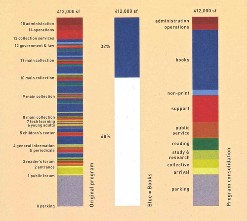
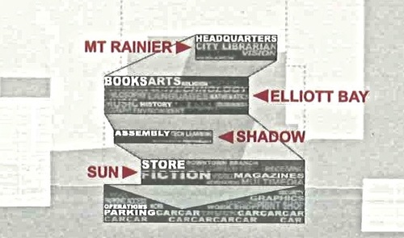
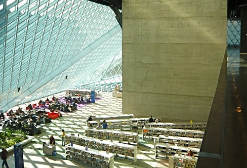
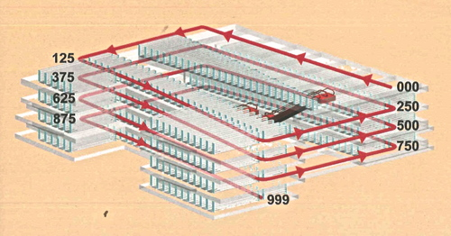
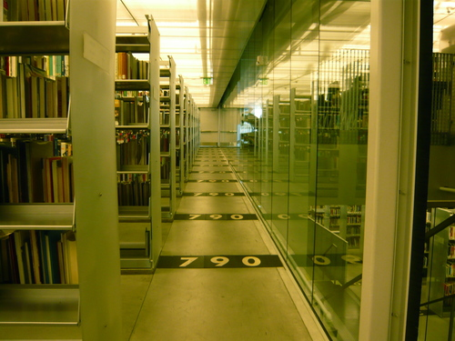

### Entwurfsprozess

Ein Blick auf den Entwurfsprozess der Seattle Public Library
verdeutlicht die Gliederung der Baumassen und die Verteilung der
Funktionen. Zu Beginn der Planungen haben Rem Koolhaas und sein
damaliger Büropartner Joshua Prince-Ramus die Defizite des Vorgängerbaus
analysiert, dessen Funktionsbereiche in unterschiedlichen Etagen
verstreut lagen. Das Schaubild (Abb. 2), welches die Binnengliederung
illustriert, erinnert an das Defragmentierungsprogramm des
Betriebssystems Windows. Es bündelt verstreute Daten und fasst sie zu
Datenblöcken zusammen, um die Zugriffszeit zu verkürzen und die
Speicherkapazität zu erhöhen. Analog dazu funktioniert das Schema der
Architekten, mit dessen Hilfe die Abteilungen des Vorgängerbaus neu
gruppiert werden. Die Bereiche sind sedimentartig aufgeschichtet und zu
kompakten Funktionseinheiten zusammengefasst, um die Zuständigkeiten und
deren Lesbarkeit zu verbessern.

Die Grundstruktur basiert auf gestapelten Boxen unterschiedlicher Größe,
die häufig mehrere Stockwerke umfassen (Abb. 3). Wo eine der Boxen über
die nächste hinausragt oder hinter diese zurückweicht, bilden sich Vor-
und Rücksprünge, die die Oberfläche des Baus beleben. Auf diese Weise
wird zugleich die Licht- und Schattenverteilung im Innern an den Bedarf
angepasst. Im Bereich der Leseplätze vergrößert sich der
Lichteinfallswinkel, da die darüberliegende Ebene zurückversetzt ist und
Tageslicht von oben einlässt. Umgekehrt treten Bereiche, die für die
Bildschirmarbeit oder für Konferenzen genutzt werden, von der
Gebäudekante zurück, so dass sie von der folgenden Ebene verschattet
werden und so vor direkter Sonneneinstrahlung geschützt sind.

Da die einzelnen Funktionseinheiten nicht unmittelbar
aufeinandergeschichtet sind, sondern einen bestimmten Abstand zueinander
einhalten, entstehen zwischen den Boxen Lufträume unterschiedlicher
Höhe, die als multifunktionale Informationsebenen genutzt werden: "The
four ‚unstable’ spaces between the platforms function as trading floors,
where librarians inform and stimulate, where the interface betweeen
different platforms is organized – spaces for work, interaction, and
play (and reading).”[^1]

Ausgangspunkt des Entwurfs ist also die Bündelung der Aufgaben, die zu
Plattformen zusammengefasst und in einem Funktionsdiagramm
veranschaulicht werden.

### Ein Bücherstapel im Straßenraum

Die Fassade der Central Public Library zeigt sich als markante Kubatur
im Stadtbild von Seattle. Wie ein locker aufgeschichteter Bücherstapel
liegt sie an einer jener steil ansteigenden Straßen, die die Innenstadt
von Seattle unverwechselbar machen. Während sich die Bürotürme der
Nachbarbauten senkrecht in den Himmel strecken und formal nicht auf das
starke Gefälle der steilen Straßen reagieren, setzt die neue
Stadtbibliothek die ungewöhnliche Topographie architektonisch fort. Mit
seinen diagonalen Fassadenelementen nimmt der Neubau die Eigenarten des
hügeligen Geländes auf.

Die geschliffenen Kanten des kristallinen Baus wecken Assoziationen an
einen Diamanten, die durch den Glanz der reflektierenden Glasfacetten
verstärkt werden. Die eigentliche Fassadenstruktur besteht aus einem
Aluminiumnetz, das dem Volumen übergestülpt wurde. Jäh abfallende
Glasflächen überbrücken nicht nur die gegeneinander verschobenen
Schichten der Geschosse, sondern zeigen auch den Beginn einer neuen
Funktionseinheit an. Denn dort, wo die Fassade außen einen senkrechten
Abschluss findet, sind innen dauerhaft und statisch genutzte Bereiche
wie das Freihandmagazin untergebracht, während sich hinter den
abgeschrägten Ebenen flexible Zonen wie etwa die öffentliche Plaza
befinden. Wo innen also die höchste Fluktuation und Betriebsamkeit
herrscht, zeigen sich auch außen dynamische Formen.

Herkömmliche Bibliotheksfassaden leugnen meist bestimmte Bereiche ihrer
Nutzung, insbesondere die ausladenden Magazinbereiche, die hinter einer
kleinteiligen Struktur verborgen werden. Die Fassade der Berliner
Staatsbibliothek (1903–14) von Ernst von Ihne beispielsweise zeigt eine
horizontale Fassadengliederung, die auf drei Etagen schließen lässt,
während sich innen tatsächlich 12 Geschosse befanden, darunter acht
niedrige Magazinetagen. Die Fassade der Königlichen Bibliothek (1774–80)
von Georg Friedrich Boumann täuscht umgekehrt mit einer doppelten
Fensterreihe eine Zweigeschossigkeit vor, wo sich nur eine Etage,
nämlich der hohe Lesesaal, befindet. In Seattle kann hingegen mit einem
bestimmten Vorwissen bereits am Außenbau zwischen statischen und
dynamischen Funktionseinheiten unterschieden werden.

### Das Wohnzimmer der Stadt

Der Westeingang an der 5th Avenue führt geradewegs in den öffentlichsten
Bereich der Bibliothek – in das Empfangszimmer der Stadt, den
sogenannten *Living Room*. Die geneigte Glaswand relativiert die Höhe
des dreigeschossigen Raumes und öffnet ihn zeltartig zur Sonnenseite
hin. Die einzelnen Funktionszonen gehen nahtlos ineinander über, da der
Raum nicht durch Wände, sondern ausschließlich durch Regale,
Ausgabetheken und Sitzmöbel gegliedert ist, über die der Blick
hinweggleiten kann. Auf einen Laden mit Souvenirs im Vordergrund folgt
ein kleines Café. Dahinter erstrecken sich mehrere Lesesessel, die die
Menschen in Vierergruppen bündeln. Sie sitzen Rücken an Rücken, so dass
die Buchseiten nur für den Leser einsichtig sind und jeder mitten im
städtischen Wohnzimmer einen gewissen Privatraum für sich beanspruchen
kann (Abb. 4).

Zwei Drittel des Raumes werden von einem scheinbar frei schwebenden
Zwischengeschoss überfangen: Ein flacher Kubus, der die Meetingebene
aufnimmt. Unter dem Zwischengeschoss sind die fiktionalen Bücher quer
zur Hauptbewegungsrichtung untergebracht. Die niedrige Deckenhöhe hebt
sich deutlich vom öffentlicheren Bereich des Raumes ab und verleiht der
Belletristikabteilung einen intimen Charakter. Die Bücherregale sind
locker im Raum verteilt. Sie bilden zwar Reihen, die aber nicht streng
parallel geführt sind und immer wieder unterbrochen werden. Diese
scheinbar zufällige Aufstellung forciert ein ungezwungenes Stöbern in
den Beständen der Unterhaltungsliteratur (Abb. 5).

### Die Buchspirale

Während die Auswahl des Freizeitlesers oft spontan erfolgt, bringt der
Leser einer Sachbuchabteilung genauere Vorstellungen mit, die mit Hilfe
des Kataloges konkretisiert werden. In einer Freihandbibliothek, wo die
Leser den Aufstellungsort der Medien selbst finden müssen, sollte das
Signatursystem besonders eingängig sein.

Ein kurzer Rückblick auf die Anfänge bibliothekarischer
Klassifikationssysteme gibt Aufschluss über deren räumliche Bedeutung.
Im Sinne einer Unterschrift ist der Signaturbegriff historisch eng
verbunden mit der Autorschaft, die wiederum mit der Individualisierung
der Druckerzeugnisse zusammenhängt. Erst seit der frühen Neuzeit wurden
die Verfasser der Bücher auf einem Titelblatt vermerkt. Die
mittelalterlichen Inventarlisten, die die Handschriften in der
Reihenfolge ihrer Aufstellung verzeichnet hatten, wurden damit obsolet.
Um auch den Aufstellungsort eindeutig zu bestimmen, wurden die Kataloge
neben jener Signatur, die sich auf den Namen des Autors bezog, auch mit
einer bibliothekarischen Signatur versehen, die die Medien im Raum
lokalisierbar machte.[^2] Jedes Buch erhielt damit eine spezifische
Adresse, die dessen genauen Standort im Raum anzeigte. Da sie im Katalog
und auf dem Buchrücken verzeichnet war, verklammerte sie die
alphabetische oder thematische "Ordnung der Kataloge mit der
real-räumlichen Anordnung der Bücher".[^3] Ein solcher alphanumerischer
Code ist lange vor der Freihandaufstellung von und für Bibliothekare
entwickelt worden. Nachdem die Magazine für den Leser geöffnet wurden,
war er für Laien oft nur schwer zu entschlüsseln.

Die komplexen Kombinationen aus Ziffern und Buchstaben haben sich
inzwischen zu einem selbstreferentiellen System entwickelt, das sich von
seiner ursprünglichen Bestimmung als Wegweiser weit entfernt hat. Der
Architekt Michael Brawne bezieht die Probleme bei der Lokalisierung von
Büchern unmittelbar auf die Bibliotheksarchitektur:

> "Wenn die Bibliothek es dem Leser erlaubt, sich sein Buch selbst zu
> beschaffen, so muß die Signatur auch einen verständlichen Hinweis auf
> den Standort des Buches enthalten. Die Übersetzung eines solchen
> abstrakten Codes in eine Botschaft, die den Weg zu einem bestimmten
> Regal vorschreibt, [...] verursacht in manchen Bibliotheken große
> Schwierigkeiten. Hier hängt viel davon ab, ob die Verkehrswege
> innerhalb der Bibliothek in verständlicher Weise organisiert und ob
> vor allem die Anordnung der Regale es erlaubt, die Bücher in logischer
> Folge aufzustellen."[^4]

Brawne erkannte bereits 1970 den engen Zusammenhang von
bibliothekarischer Signatur und architektonischer Wegführung. Doch erst
in der Seattle Public Library drückt sich dieser Zusammenhang auch
baulich aus. Die strenge Systematik der Sachbuchabteilung kommt der
gezielten Büchersuche entgegen. Die mäandernde Buchspirale, die das
Freihandmagazin erschließt, entfaltet sich zwischen dem sechsten und dem
neunten Level in einem kontinuierlichen Rundgang (Abb. 6).

### Die Dewey-Dezimalklassifikation materialisiert sich

Um die Unwägbarkeiten der Büchersuche zu überwinden, entwickelte das
Architektenduo Koolhaas und Ramus für die Seattle Public Library ein
räumliches System, welches das Verhältnis zwischen Leser, Buch und Weg
neu definiert. Grundlage ist ein weltweit verbreitetes Signatursystem,
welches sich in den USA seit langem bewährt und in Deutschland nur
selten angewendet wird: die Dewey-Dezimalklassifikation, die 1873 von
Melvil Dewey für die Bibliothek des Amherst College in Massachusetts
entwickelt wurde.[^5] Dewey beschreibt die Vorteile seiner
Klassifizierung mit folgenden Worten: "It was to get absolute simplicity
by using the simplest known symbols, the arabic numerals as decimals,
with the ordinary significance of nought, to number a classification of
all human knowledge in print”.[^6]

Das System basiert auf einer streng hierarchischen, logischen Folge von
Zahlen, die die entsprechenden Fachgebiete und deren Unterkategorien
bezeichnen und deren arabische Zahlen wie Dezimalbrüche funktionieren.
Die bibliothekarischen Vorteile liegen auf der Hand: "Deweys relative
Ordnung nach dem Dezimalsystem machte eine Reklassifikation aus
Raumgründen überflüssig, da die Bücher nach ihrem intellektuellen Gehalt
und nicht mehr nach ihrem Aufstellungsort geordnet wurden. Letzterer
konnte sich ändern, Ersterer nicht."[^7]

Für die Aufstellung bedeutet dies, "dass sie die Gleichordnung und die
Unterordnung von Themen, intellektuell wie auf dem Bibliotheksregal, (in
einem Arbeitsschritt) wiedergeben kann und expandiert werden kann, ohne
die bereits geschaffene Ordnung der Themen zu zerstören."[^8] Seit der
16. Auflage von 1958 ist die ständig weiterentwickelte Klassifikation
auch in der Lage, Beziehungen zwischen einzelnen Themen und Fachgebieten
aufzuzeigen.

Für den Leser repräsentiert die homogene Zahlenreihe vor allem
Kontinuität, die architektonisch häufig durch trennende Elemente wie
Raum- oder Geschosswechsel zerstört wird. Um Wegführung und Büchersuche
in ein kausales Verhältnis zu setzen, überführen die Architekten die
Dewey-Dezimalklassifikation in eine architektonische Struktur, die
vollkommen linear lesbar ist.

### Der Weg als architektonisches Leitsystem

Die spiralförmige Anordnung der Wege im Handmagazin vereint horizontale
und vertikale Bewegungsabläufe (Abb. 7). Nicht Treppen und Rampen
erschließen die Bestände, sondern die Geschossebenen selbst steigen in
einem Winkel von zwei Grad an. Auf diese Weise gehen die
unterschiedlichen Etagen von Level fünf bis neun nahtlos ineinander über
und bilden eine räumliche Einheit. Da die Geschossdifferenzierung
aufgehoben ist, verändert sich die Bewegung der Benutzer und damit die
Büchersuche grundlegend.

Während Architekten wie Max Dudler bei ihren Bibliotheksentwürfen von
der statischen Aufstellung der Bestände ausgehen und das Regal zum
Grundmodul erklären, setzen Koolhaas und Ramus beim kinetischen Zugriff
auf die Bücher an. Sie definieren auf diese Weise keinen dauerhaften Ort
der Lagerung und Bewahrung, sondern einen kinetischen Handlungsraum, in
dem die Aktivitäten der Benutzer die Struktur bestimmen. Die
Suchbewegung zwischen den Regalen schafft ein Raumgebilde mit fließenden
Übergängen, welches genau wie die homogene Zahlenreihe der
Dezimalklassifikation fortlaufend ist. Die ersten drei Zahlen der
Dewey-Signatur, die das Fachgebiet anzeigen, sind in den Boden der
Buchspirale eingelassen, so dass sich der Benutzer stets in einem
bestimmten Bereich verorten kann und im weiteren Wegverlauf eine
übersichtliche Vorschau auf die kommenden Bestände erhält.

Die Buchspirale umkreist eine Mitte, die ebenfalls der Erschließung
gewidmet ist. Treppen ermöglichen einen schnellen Wechsel zwischen den
langsam ansteigenden Rampen. Sie funktionieren als Abkürzungen, um auf
direktem Wege von einem Fachgebiet ins nächste zu gelangen und werden
besonders von den ortskundigen Bibliothekaren genutzt, die die genauen
Querverbindungen zwischen den Abteilungen kennen.

Die eingängige Dezimalklassifikation von Melvil Dewey wird in Seattle
erstmals architektonisch gelesen und in eine adäquate räumliche Struktur
übersetzt, die linear, kontinuierlich und einheitlich ist.

### Aufgaben der Öffentlichen Bibliothek

Bibliotheken setzen heute vielfach auf eine zukunftsweisende
Architektur, um ihr verstaubtes Image abzulegen und glaubhaft zu
vermitteln, dass sie den Herausforderungen der Digitalisierung gewachsen
sind. Die zunehmende Virtualisierung der Wissensgesellschaft verlangt
als Gegengewicht nach konkreten öffentlichen Begegnungs- und
Versammlungsorten, die die soziale Isolation des Einzelnen vor dem
Bildschirm kompensieren. Der Architekturkritiker Paul Goldberger sieht
den Nutzen der Central Public Library in Seattle im digitalen Zeitalter
darin, dass der öffentliche Lesesaal das Lesen als kulturellen Akt
nobilitiert und das Buch gegenüber konkurrierenden Unterhaltungsmedien
stärkt:

> "We don’t need big library buildings the way we once did, but if you
> surf the Internet at home you are just a click away from a video game.
> When you do it here, you feel that you are engaged in a serious
> pursuit. A building like this emphasizes the value a culture places on
> literacy.”[^9]

Die zunehmende Unabhängigkeit der Informationsmedien von Raum und Zeit
verstärkt das Bedürfnis nach räumlicher Verortung und sozialer
Vernetzung. Neben gesellschaftlichen Funktionen übernehmen die neuen
öffentlichen Bibliotheken daher auch Aufgaben der lokalen
Identitätsbildung, der bildungsbürgerlichen Selbstvergewisserung und der
zwischenmenschlichen Interaktion. Dabei muss es nicht zwingend zum
konkreten Gedankenaustausch kommen. Sobald unterschiedliche Menschen
ähnlichen Tätigkeiten nachgehen, wird das räumliche Nebeneinander in
einer angenehmen Umgebung als gesellschaftliches Miteinander
empfunden.[^10]

Im Begleittext zu seinem nicht realisierten Entwurf für die Très Grande
Bibliothèque de France konstatierte Koolhaas bereits 1989 die zunehmende
Verlagerung von zentralen Aufgaben der Architektur in virtuelle Räume
und proklamierte, "daß angesichts der elektronischen Zersplitterung die
letzte Aufgabe der Architektur darin besteht, symbolische Räume zu
schaffen, die dem unstillbaren Verlangen nach Gemeinschaft
entsprechen.”[^11]
Koolhaas besinnt sich damit auf die ursprünglichsten Fähigkeiten der
Architektur. Mit der Begünstigung von sozialem Austausch im direkten
Gegenüber setzt er auf eine archetypische Qualität der Baukunst, die ihr
durch technische Innovationen nicht streitig gemacht werden kann. Im
Entwurf für die Très Grande Bibliothèque ist die soziale Aufwertung von
öffentlichen Versammlungsräumen bereits auf dem Papier entwickelt. Im
städtischen ‚Wohnzimmer’ der Seattle Public Library ist die Idee
schließlich umgesetzt worden. Die öffentliche Plaza mit
multifunktionaler Nutzung dient nicht nur als Empfangszimmer der
Bibliothek, sondern auch als städtische Kommunikationszone.

### Der lange Weg zur uneingeschränkten Zugänglichkeit

Bibliotheken sind sich ihrer identitätsstiftenden Rolle für die
städtische Öffentlichkeit bewusst. In Seattle genießen sie den
besonderen Rückhalt der Bürger, die in einem Volksentscheid knapp 200
Millionen Dollar für deren Ausbau bewilligt haben.[^12] Die liberalen
Zugangsbestimmungen der Seattle Public Library, die selbst Wohnungslose
willkommen heißt, wurde 1998 mit Hilfe der Initiative "Libraries for
All"[^13] beschlossen. Voraussetzung für jene Bewegungsfreiheit, die
heutige Bibliotheken auszeichnet, ist die uneingeschränkte
Zugänglichkeit von Bibliotheksgebäuden und später auch von deren
Buchbeständen, die sich über einen langen Zeitraum herausbildete.

In der Geschichte der Bibliotheksarchitektur finden sich überraschend
frühe Beispiele für allgemein zugängliche Büchereien, die jedoch
Ausnahmen blieben. Eine der ersten Öffentlichen Bibliotheken befindet
sich im Dominikanerkloster von San Marco in Florenz. Sie wurde ab 1438
von Michelozzo für Cosimo de Medici erbaut. Niccolò Niccoli hatte dem
Kloster seine 800 Bände umfassende Büchersammlung unter der Bedingung
überlassen, dass sie "commune utilità di ciascuno" (zur allgemeinen
Nutzung) zugänglich sein müsste.[^14]

Wichtige Entwicklungsschritte auf dem Weg zur Öffentlichen Bibliothek
bilden die Alphabetisierung der Laien während der Reformation, die
geistige Emanzipation des Bürgertums seit der Aufklärung, die
Abschaffung des Absolutismus in der Französischen Revolution und die
Maßnahmen der Sozialdemokraten zur Verbesserung der Allgemeinbildung.
Alle diese Schritte trugen zur demokratisch legitimierten Volksbildung
bei.

Eine wichtige Voraussetzung für die Gründung von Stadtbüchereien war die
Loslösung der Bibliotheken aus Klöstern, Schlössern und Universitäten.
Die 1778 fertiggestellte Königliche Bibliothek in Berlin markiert einen
wichtigen Schritt hin zu einer allgemein zugänglichen
Bildungsinstitution. Die sogenannte ‚Kommode’ wurde wie die Lindenoper
zwar vom König, aber unabhängig vom Schlosskomplex geplant. Spätestens
seit der Industrialisierung verfügte das selbstbewusste Bürgertum über
eine wachsende Allgemeinbildung, die sich parallel zu den
Errungenschaften in der Wissenschaft auch mit Hilfe des in Bibliotheken
zugänglichen Wissens entwickelte.

In den Vereinigten Staaten sicherte der Carnegie Trust von 1897 die
ideelle und finanzielle Grundlage, damit sich die Public Library als
soziale und kulturelle Institution etablieren konnte. Der Philanthrop
Andrew Carnegie, der nicht nur in den USA zahllose Öffentliche
Bibliotheken gestiftet hatte, sorgte 1901 auch für den Wiederaufbau der
niedergebrannten Bücherei in Seattle, nachdem die Stadt den Kauf eines
Grundstücks und die Finanzierung der Betriebskosten zugesichert
hatte.[^15]

Bereits 1747, noch vor der Gründung der Vereinigten Staaten, plädierte
die Redwood Library in Newport, Rhode Island, für die unvoreingenommene
Gleichbehandlung ihrer Nutzer, damit "the curious and impatient Enquirer
[...] and the bewildered Ignorant might freely repair".[^16] Nachdem der
freie Zugang zur Bibliothek sich allmählich durchzusetzen begann, folgte
als zweiter wichtiger Entwicklungsschritt der freie Zugriff auf das
Buch, der zuerst in den USA verbreitet war. Seattle führte die
Freihandaufstellung als erste Stadt an der Westküste ein: bereits um
1900 waren die Bestände "open for patrons to browse".[^17]

Mit der Gründung der Amerika-Gedenkbibliothek in Berlin (AGB) 1951–54,
die nach dem Krieg von amerikanischen Bürgern gestiftet wurde, konnten
die Berliner erstmals von den liberalisierten Bedingungen jenseits des
Atlantiks profitieren. Auf Anregung von Fritz Bornemann errichtete die
Architektengemeinschaft von Gerhard Jobst, Willy Kreuer und Hartmut
Wille die erste Freihandbibliothek nach amerikanischem Vorbild.[^18]
Dass die Leser ohne Umweg über Katalog und Bestellschein ungehindert auf
die Bestände zugreifen konnten, stieß damals auf heftige Kritik von
Politikern, Bibliothekaren und Wissenschaftlern.[^19]

Beim Bau der AGB verzichteten die Architekten bewusst auf Schwellen wie
monumentale Freitreppen, hohe Portale und massive Mauern (Abb. 8).
Stattdessen gestalteten sie den Eingangsbereich ebenerdig und
verwendeten viel Glas, um Offenheit zu demonstrieren. Der freie
Grundriss ermöglicht die freie Zirkulation zwischen den Beständen und
bildet auf diese Weise ein architektonisches Pendant zu den
Freihandmagazinen.

Als durch das immense Anwachsen der Bestände vielerorts eine räumliche
Trennung von Buch und Leser nötig geworden war, legte das Buch auf
Bücherwagen, Laufbändern und in Aufzügen lange Wege vom geschlossenen
Magazin bis zur Ausgabetheke zurück. Nach der Buchausgabe wurde die
Lektüre im Lesesaal von einer Aufsicht überwacht. Heute zirkuliert
weniger das Buch als der Leser selbst, der besonders in Öffentlichen,
zunehmend aber auch in Wissenschaftlichen Bibliotheken freien Zugriff
auf die Bestände in den Regalen erhält. Dabei verändert sich auch die
Auswahl der Bücher. Bibliothekarisch gut gepflegte Nachbarschaften
einzelner Wissensgebiete führen zu Zufallsfunden, eröffnen unerwartete
Bezüge und ermöglichen vielfältige Vergleiche. Selbst eine
ausgezeichnete Suchmaschine kann semantische Zusammenhänge nur
unzureichend herstellen. Manuelle und elektronische Suchsysteme hängen
zu sehr vom exakten Begriff ab, während es bei der Verschlagwortung
meist hapert und metaphorisch formulierte Titel fortwährend auf Irrwege
führen.

### Zusammenfassung

Ausgangspunkt des Entwurfs von Rem Koolhaas und Joshua Prince-Ramus ist
nicht die Aufbewahrung der Bücher, sondern der Zugriff durch den Leser,
dem ein Suchprozess vorangeht. Die Bewegungsbahnen des Benutzers werden
über die Architektur und das Signatursystem gleichermaßen gelenkt. Die
kongeniale Entsprechung von architektonisch festgelegtem Weg und
bibliothekarisch definiertem Aufstellungsort setzen Leser, Buch und Raum
in ein neues, fließendes Verhältnis. In Seattle wird der Weg auf der
mäandernden Bücherrampe nicht mehr willkürlich von der Geschossfläche
limitiert, sondern entwickelt sich als einheitliches System, dessen
Kontinuität den fortlaufenden Dezimalziffern der Dewey-Klassifikation
entspricht.

Doch Aufgabe einer Bibliothek ist nicht mehr allein die Hinführung zum
Buch. Das Gebäude selbst muss anziehend wirken, um die Menschen hinter
dem heimischen Bildschirm hervorzulocken und sie zu einem Besuch zu
mobilisieren. Auf einem Rundgang durch den Bau lernen die Besucher das
Gebäude kennen und werden dazu ermuntert, Recherchieren und Lesen als
Gemeinschaftserlebnis wahrzunehmen. Denn die Seattle Public Library
versteht sich in erster Linie als kommunaler Versammlungsort für eine
städtische Öffentlichkeit. Die Verdoppelung der Besucherzahlen im Neubau
belegt, dass Stadtbewohner ein großes Bedürfnis nach Orten ohne
Konsumzwang haben, wo sie sich versammeln und austauschen oder einfach
im Stillen ein Buch lesen können.

### Benutzte Literatur

Brawne, Michael: Bibliotheken. Architektur und Einrichtung, Stuttgart
1970

Chan, Lois Mai: Dewey-Dezimalklassifikation, München 2006

Eigenbrodt, Olaf: Bibliotheken als Räume urbaner Öffentlichkeit.
Berliner Beispiele, Berlin 2005

Erben, Dietrich: "Die Pluralisierung des Wissens. Bibliotheksbau
zwischen Renaissance und Aufklärung", in: Ausst.-Kat. Die Weisheit baut
sich ein Haus. Architektur und Geschichte von Bibliotheken, hrsg. von
Winfried Nerdinger und Werner Oechslin, München 2011, S. 93-130

Goldberger, Paul: "High-Tech Bibliophilia. Rem Koolhaas’s new library in
Seattle is an ennobling public space", in: The New Yorker, 24.5.2004

Güttler, Peter: "Bibliotheken", in: Berlin und seine Bauten, Teil V,
Bauwerke für Kunst, Erziehung, Wissenschaft, hrsg. von Architekten- und
Ingenieur-Verein zu Berlin, Bd. B (Hochschulen), Berlin u.a. 2004

Jochum, Uwe: Kleine Bibliotheksgeschichte, Stuttgart 2007

Kleine, Holger: "Der Staat und seine Bibliothek", in: Bauwelt, 88. Jg.
1997, S. 1099ff.

Seattle Public Library. OMA - LMN, hrsg. von Kubo, Michael und Ramon
Prat, Barcelona 2005

Moser, Fritz: "Rückblickend auf die Anfänge", in: 25 Jahre
Amerika-Gedenkbibliothek. Berliner Zentralbibliothek, hrsg. von Peter K.
Liebenow, München u.a. 1979, S. 35-70

OMA: "Bibliothèque de France, Paris, 1989", in: OMA. Rem Koolhaas, hrsg.
von Jacques Lucan, Zürich 1990 [Princeton 1989], S. 132-133

Pevsner, Nikolaus: Funktion und Form. Die Geschichte der Bauwerke des
Westens, Frankfurt am Main 1998 [History of Building Types, Princeton
1976]

**Abbildungsnachweis**

Abb. 1, 4, 5, 7: Fotografin: Tina Zürn, 2009

Abb. 2, 3, 6: aus: Kubo/Prat 2005, S. 18, 30, 35

Abb. 8: Bildarchiv Foto Marburg

[^1]: Kubo/Prat 2005, S. 26.

[^2]: Siehe: Jochum 2007, S. 84ff.

[^3]: Erben 2011, S. 157.

[^4]: Brawne 1970, S. 129f.

[^5]: Seit 2005 liegt die Dewey-Dezimalklassifikation auch in deutscher
    Übersetzung vor. In den USA nutzen 95% aller Schul- und öffentlichen
    Bibliotheken, 25% aller College- und Universitätsbibliotheken und
    20% aller Spezialbibliotheken das System. Siehe: Chan 2006, S. 26.

[^6]: Dewey 1920, S. 152.

[^7]: Chan 2006, S. 19.

[^8]: Ebd., S. 27.

[^9]: Goldberger 2004.

[^10]: Ähnlich bei: Eigenbrodt 2005, S. 17.

[^11]: OMA 1990, S. 132.

[^12]: Siehe dazu die Selbstdarstellung der SPL im Internet:
    http://www.spl.org (Zugriff am 11.12.2014).

[^13]: Zur Initiative "Libraries for all” siehe:
    <http://www.spl.org/Documents/about/libraries_for_all_report.pdf>
    (Zugriff am 11.12.2014).

[^14]: Zitiert nach: Pevsner 1998, S. 94.

[^15]: Die Geschichte der Seattle Public Library ist dokumentiert auf
    der Internetpräsenz der Bibliothek unter:
    <http://www.spl.org/default.asp?pageID=about_operations_history&view=text>
    (Zugriff am 18.5.2014).

[^16]: Fletcher 1894, S. 12, zitiert nach: Pevsner 1998, S. 104.

[^17]: Siehe:
    <http://www.spl.org/default.asp?pageID=about_operations_history&view=text>
    (Zugriff am 18.5.2014).

[^18]: Siehe: Güttler 2004, S. 239. Eine Freihandaufstellung im größeren
    Ausmaß hatte es in Deutschland bis dahin nur in den Hamburger
    Bücherhallen gegeben. Siehe: Moser 1979, S. 49.

[^19]: Siehe: Kleine 1997, S. 1100.
